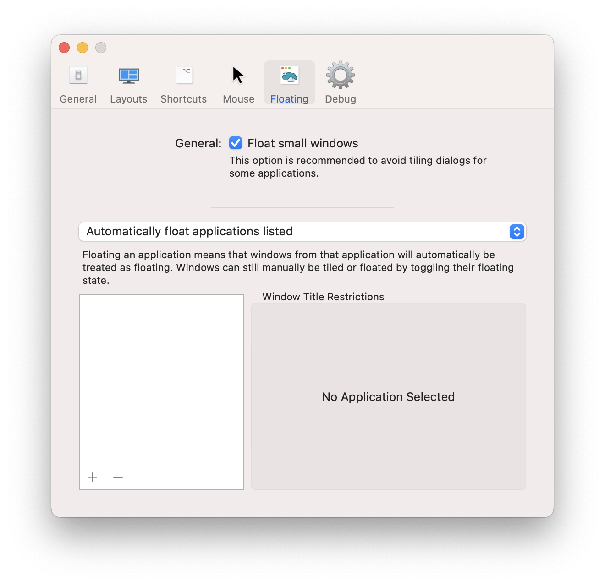

# Troubleshooting

## Nothing is working!

Here are some common problems and their solutions.

### "Always float"

Amethyst has the option to float everything by default until the user manually intervenes. When this mode is unintentionally enabled it can appear that nothing is working. The option is located in settings in the Floating tab and configured with the `floating-is-blacklist` key in a configuration file.

If you have not intentionally enabled this make sure that the option in the Floating tab says "Automatically float applications listed" as in this screenshot.

